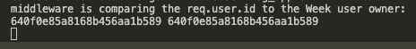
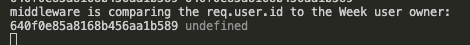

# Veg App frontend React SPA        

26/02/23:       
- `create-react-app` used to set up project.        
- Faintly horrifying AI-generated background image added from [_Fotor_](http://fotor.com/).            
- _MUI_ default install completed.      
- Breathtakingly professional logo created by [_LOGO_](https://app.logo.com/).     
- MUI sign up template added.       

27/02/23:       
- `react-router-dom` installed, MUI sign in template also added. _Having some intial difficulty nesting routes within routes (specifically `/auth` for Auth-main component and then onto child components for sign in and sign up.)_.       
- Clearly quite rusty in this regard: quickly realised I should not be using `<Router>` elements in child components... Thanks to the [tutorial here](https://dev.to/tywenk/how-to-use-nested-routes-in-react-router-6-4jhd) I was able to get things working as intended.      

28/02/23:       
- Console error : `Warning: validateDOMNesting(...): <body> cannot appear as a child of <div>.` resolved through changing `<body>` element in `App.js` to a `<div>`.        

01/03/23:       
- Also seeing `Matched leaf route at location "/user/signup" does not have an element. This means it will render an <Outlet /> with a null value by default resulting in an "empty" page.` - app seems to be working as intended but I want to resolve this issue as it appears.      
- Firstly, it does not appear to be caused by either the use of a deprecated prop or the presence of a typo as per [stackoverflow](https://stackoverflow.com/questions/69854011/matched-leaf-route-at-location-does-not-have-an-element). Having confirmed version of `react-router-dom` as `6.*`, I checked the relevant documentation and a series of articles without shedding any light on the issue.       
- Eventually - through playing around - I was able to resolve the issue through the use of Outlet and the deletion of unneeded child routes in `App.js` like so:     

```
// App.js:
    <Routes>
      <Route path='/' element={<Home />}></Route>
      <Route path='user/*' element={<Auth />}></Route>
    </Routes>
```     

```
// Auth-main.js
<Routes>
  <Route path='signin' element={<SignIn />}></Route>
  <Route path='signup' element={<SignUp />}></Route>
</Routes>
<Outlet />
```     

_Errors/warnings now cleared!_      

--- 

       

---     

- Now working on hooking up signup to the back end. Firstly, I have quickly been able to get a new user `{ userName, emailAddress, password }` from `User-signup` form.     
- Next, Axios installed and `registerHandler` function passed to main auth and then signin as props. A couple of silly mistakes - again thanks to being rusty - for example failing to include `props` when declaring functional components in auth and signin, and passing register handler as a function call rather than a variable...       
- `user` now being passed successfully back to `App.js`:        
       

- Next step is linking frontend to backend!     
_Aaaand look who it is!:_     
      

- `"proxy"` added in `package.json`.        
- Issue seen where relative route being used in `Axios.post` (e.g. `localhost:3000/user/auth/signup` rather than `localhost:3000/auth/signup`) - very simple fix of course: adding a `/` in front of post route.       


_Now all working ok!_       

---     
        

---     

      

---     

- Next step is to handle successful requests by returning a valid token, saving in session storage and then redirecting to the appropriate page. 
    _Note - this was not the next step...!_               

06/03/23:       
- Having revisited this after a couple of days off, I immediately spotted that the frontend was returning a message in the response but no token. Backend updated to ensure a 'good' response is returned correctly.        
- Another issue seen: upon first form submit an Axios error is returned, however the second form submit works ok. Subsequent submissions result in alternating 'not working, working' pattern:      

        

_Upon looking more closely, `App.js` is not being passed a `user` object: on first submit this results in a 500 error, on subsequent submits the previously submitted `user` is passed to `registerHandler` (hence the later 400 error code with the message `message : "Email already exists"`)._      

- Looking at console.logs, the issue seems to lie with the fact that the `newUser` state in `User-signup.js` is not updating in time before being sent via `registerHandler`.       
- _I've got a choice here:_ one option is to update newUser using a change handler on each keystroke (meaning a fully updated newUser is ready upon submit button click). The other option - the one that I have gone for - is to use `useEffect`, calling `registerHandler` with the updated `newUser` passed in (within an `if` statement to prevent a `registerHandler` call upon first component load):     

```
  useEffect(() => {
    console.log(newUser)
    if (newUser.userName) {
      registerHandler(newUser)
    }
  })
```

_I've realised that the above solution can be dispensed with and the entire functionality simplified through avoiding using states altogether, instead passing the `user` object from the form directly into `registerHandler`..._

```
  const registerHandler = user => {
    props.register(user)
  }

  const handleSubmit = async (event) => {
    event.preventDefault();
    const data = new FormData(event.currentTarget);
    const user = {
      userName: data.get('Username'),
      emailAddress: data.get('email'),
      password: data.get('password'),
    }
    registerHandler(user)
  };
```     

_Now I should be able to focus on storing a valid token and redirecting to the appropriate page!_       

- `registerHandler` updated to now save tokens in Session Storage.      

07/03/23:       
- Ran into a series of issues getting redirects to work: the root cause of the issue was where I was trying to use `useNavigate` outside of the context of `<Router>` - new approach has been wrapping the `<App />` component within a Router in `index.js`, rather than putting the `<Router>` component inside the `<App>` component as before - [suggested by this article](https://bobbyhadz.com/blog/react-usenavigate-may-be-used-only-in-context-of-router).        
- Eventually working as I can now use `useNavigate()` within my app component in order to redirect users upon sign up.      
- `NoMatch` component added to `path='*'` to catch unmatched routes.        

13/03/23:     
Working on Sign In: requests are firing but user is not being found:    


- However after a quick check of my own backend API documentation (_which I am grateful to past me for writing for the benefit of current me_) I realised I was using `email` as a key rather than `emailAddress`...which now works:    

    

- New token saves successfully in session storage. Redirect works fine too!
- I've refactored `loginHandler` and `registerHandler` into a single function, `authHandler`, tested working ok.    

Now working on responsive navigation depending on login status:   

- Firstly, I am going to retrieve username from the saved token within `sessionStorage` using `jwt-decode`, this is then saved as a state within `App.js` and will be used to check if a user is logged in, and for displaying a welcome message.   
- Logout functionality added which clears `sessionStorage` and sets the `loggedInUser` state in `App.js` to `null`.   
- Nav bar renders conditionally depending on if user is logged in or not.   
- Greeting message added and placeholder User Profile page added.   
- `getLoggedInUser` implemented within `useEffect` in `App.js` - this is to prevent App component from rendering nav bar as no logged in user upon manual refresh.    

Tidying up Nav bar further:   
- Refactored out nav bar into a component within `main/` along with Home component. Had some issues where logout functionality was not working - issue seemed to be with `e.preventDefault()` not working as expected. Resolved by passing `e` from function call within Nav component.   
- Now implementing a *MUI* `<AppBar>` to quickly improve the appearance of the app bar and add a responsive 'drawer' on smaller screen.   
- Where `<Link>` is used instead of MUI's default `<Button>` or similar, the formatting looks out of place - this has been updated (_albeit slightly clumsily using CSS to override MUI's theme(s)_).      

14/03/23:   

I'm now going to start mapping out the remaining key components:    
- "Week" CRUD operations will be accessed via a `WeekDisplay` component. Child Components: `CurrentWeek`, `WeekIndex` added.     
- I'm going to attempt to GET current week upon login, if no current week is found then one will be created. Initial attempts have resulted in overcomplicated auth functionality - in particular, `getLoggedInUser` within `useState` no longer triggers a 'logged in' state upon manual refresh.   
- Auth functionality now refactored significantly: functions renamed as well as restructured, 'User' related state changed from username string to an object, 'get', 'set' and 'check' functions abstracted out into `updateStateFromToken`, `try...catch` statements used in cases where `if...else` previously used for error handling. For example:    

```
  const authHandler = (route, user) => {
    Axios.post(`${route}`, user)
      .then(res => {

        checkForTokenAndSave(res.data.token)

        if (res.data.token) {
          const user = getLoggedInUser(sessionStorage.token)
          setLoggedInUser(user.username)
          setLoggedInUserId(user.id)
          checkForCurrentWeek(user)
          navigate('/')
        }

      })
      .catch(err => {
        console.error(err)
      })
  }
```

...is now:      

```
  const authHandler = (route, user) => {
    Axios.post(`${route}`, user)
      .then(res => {
        saveTokenToStorage(res.data.token)
        updateStateFromToken(sessionStorage.token)
        navigate('/')
      })
      .catch(err => {
        console.error(err)
      })
  }
```

_I have had to use `// eslint-disable-next-line react-hooks/exhaustive-deps` within `useEffect` as per [this stack thread](https://stackoverflow.com/questions/55840294/how-to-fix-missing-dependency-warning-when-using-useeffect-react-hook) - not sure if this is a bodge though..._   

- `Nav.js` updated to take `currentUser` object as prop, which is then split into `isLoggedIn` and `username` to more clearly differentiate where and how this prop is being used.    
- Ditto `UserProfile`, which now also redirects to Sign In if no user prop is found on render.   

15/03/23:   
- Attempting to GET CURRENT WEEK upon login, however I am seeing issues with Axios calls: specifically to do with the `x-auth-header` which should contain a valid token.   

17/03/23:   
- Looking at this with fresh eyes I've seen two problems:   
  - Firstly, I was passing the whole `currentUser` state as an object into the Axios request body, when it only takes an `id`.    
  - Secondly, my backend authorisation middleware is returning a 403 error from my frontend Axios requests: the `req.user.id` decoded from the token sent in headers is not matching the `userOwner` id sent in the request body. _Interestingly, I do not get this error when sending the same request from Postman_ - my initial guess would be that there is a problem with the Axios `x-auth-token` header being sent. I've added `.log()`s to my backend to see what comes through on each:    

  _Postman:_    

      

  _Axios:_    

      


  - Further logging shows that the Axios `req.body` is empty: hence the `undefined` coming through in the backend.    
  - Aaaand [I think I might have found out why](https://stackoverflow.com/questions/46404051/send-object-with-axios-get-request) - looks like I need to either a) try using `fetch()` instead or b) redesign my GET requests so that they use query params instead. Lesson learned...!    

20/03/23:   
- Upon further digging I found that the `window.fetch()` approach considered above would not work either: as such I went back and updated my backend API to use PUT requests where a `request.body` is required for document selection.   
- Frontend updated to use a `put` method which finally works! Needs refactoring and cleaning up but a major learn for me and a substantial blocker overcome.    

- `logoutHandler` updated to also clear `currentWeek` state using `nullWeek` object.    

- `checkForCurrentWeek` refactored, this included refactoring out the Axios PUT request w/ a userOwner body: this can now be reused elsewhere. _Had to use async to allow for a `.then().catch()`.    


## Issues to resolve:   
- MUI themes currently being directly overridden using CSS - needs updating to use MUI Theming instead.   
- CSS requires refactoring.   

## Features to add:
- Messages to be provided to user upon login, failed login, sign in, etc.     